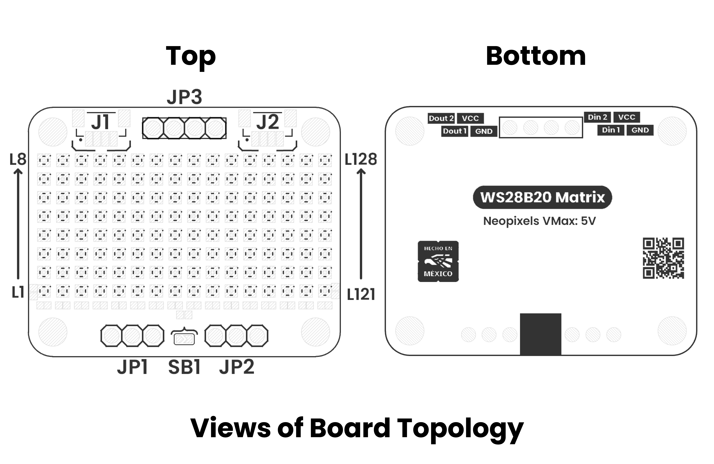

# Hardware

<a href="./unit_sch_v_1_0_0_ue0112_ws28b20_matrix_rgb_8x16.pdf"> Schematic</a>

## 🔌 Pinout

    <a href="#"> Pinout</a>
     
     
     
    

| Pin Label | Function    | Notes                             |
|-----------|-------------|-----------------------------------|
| VCC       | Power Supply| 3.3V or 5V                       |
| GND       | Ground      | Common ground for all components  |

## 📏 Dimensions

<a href="./resources/unit_dimension_v_1_0_0_ue0112_ws28b20_matrix_rgb_8x16.png">  Dimensions</a>

## 📃 Topology

<a href="./resources/unit_topology_v_1_0_0_ue0112_ws28b20_matrix_rgb_8x16.png">  Topology</a>
 
 
 

| Ref.     | Description                              |
|----------|------------------------------------------|
| JP1      | 2.54 mm Pin Header                       |
| JP2      | 2.54 mm Pin Header                       |
| JP3      | 2.54 mm Pin Header                       |
| J1       | JST 1 mm Pitch Connector for Data Input  |
| J2       | JST 1 mm Pitch Connector for Data Output |
| L1-L64   | WS28B20 Neopixel for Matrix 1            |
| L65-L128 | WS28B20 Neopixel for Matrix 2            |
| SB1      | Solder Bridge to Join Both Matrices      |

## Pin & Connector Layout
| Pin   | Voltage Level | Function                                                  |
|-------|---------------|-----------------------------------------------------------|
| VCC   | 3.3 V – 5.5 V | Provides power to the on-board regulator and sensor core. |
| GND   | 0 V           | Common reference for power and signals.                   |
| SDA   | 1.8 V to VCC  | Serial data line for I²C communications.                  |
| SCL   | 1.8 V to VCC  | Serial clock line for I²C communications.                 |

> **Note:** The module also includes a Qwiic/STEMMA QT connector carrying the same four signals (VCC, GND, SDA, SCL) for effortless daisy-chaining.

## Functional Description

{{functional_description}}

## Applications

{{applications_list}}

# References

- [{{datasheet_name}}]({{datasheet_url}})
